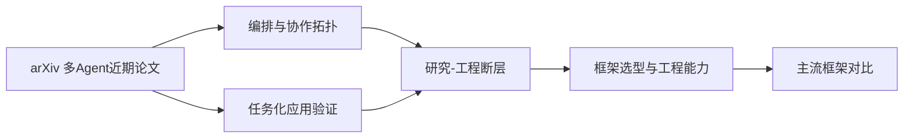

# 多Agent研究与工程落地地图

本页用于连接“论文趋势”与“框架工程”两类证据，减少研究结论直接外推到生产系统时的误配。

## 导航链接

- 论文来源：[[来源-搜索归档-多Agent-arXiv-2026-06-20]]
- 论文对比：[[多Agent论文方向对比-2026H1-arXiv]]
- 工程概念：[[Agent框架选型与工程维度]]
- 工程对比：[[主流Agent框架对比-2026-06-20]]
- 相关来源：[[来源-搜索归档-Claude-Code-Minimal-Stack-2026-06-20]]
