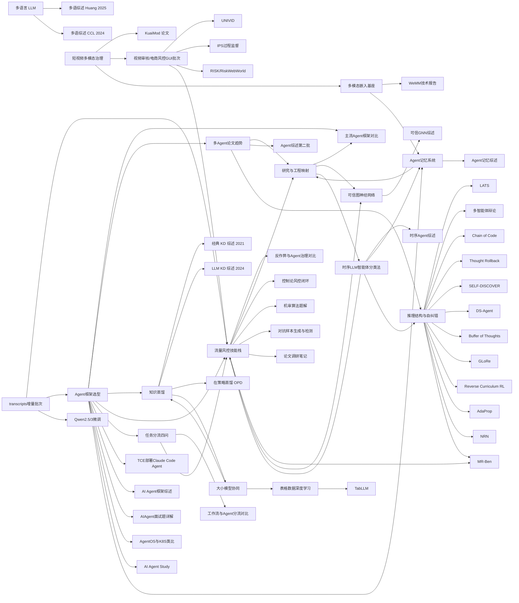

# 研究主题导航

本页用**主题地图**串起当前已摄入的综述与概念页，便于从问题域跳转。

## 对应页面

- [[知识蒸馏]] · [[来源-知识蒸馏综述-2021-Gou]] · [[来源-大语言模型知识蒸馏综述-2024]] · [[来源-大语言模型在策略蒸馏综述]]
- [[大语言模型与多语言]] · [[来源-多语言大语言模型综述-2025-Huang]] · [[来源-大模型时代多语言研究综述-CCL-2024]]
- [[大小语言模型协同]] · [[来源-大小语言模型协同机制综述-2025]]
- [[表格数据深度学习]] · [[TabLLM]] · [[来源-表格数据Transformer模型综述与实践]]
- [[表格建模选型决策树]] · [[表格建模路线对比-TabLLM-vs-树模型-vs-Transformer]]
- [[短视频内容审核与多模态治理]] · [[来源-KuaiMod-VLM-短视频审核]]
- [[Agent框架选型与工程维度]] · [[主流Agent框架对比-2026-06-20]] · [[来源-搜索归档-Agent框架-2026-06-20]]
- [[多Agent系统研究趋势与工程映射]] · [[多Agent论文方向对比-2026H1-arXiv]] · [[来源-搜索归档-多Agent-arXiv-2026-06-20]]
- [[多Agent研究与工程落地地图]] · [[来源-搜索归档-Claude-Code-Minimal-Stack-2026-06-20]]
- [[流量风控技能栈与Agent治理]] · [[传统流量反作弊与Agent流量治理对比]] · [[来源-搜索归档-流量风控skills-2026-06-20]]
- [[来源-搜索归档-Agent风控情报Watch-2026-06-21]]（定时情报批次，含平台偏移与证据分层标注）
- [[Agent任务分流：工作流与智能体边界]] · [[工作流与Agent任务分流对比-2026-06-21]] · [[来源-构建Agent的四个问题-2026-06-21]]
- [[来源-raw-transcripts增量批次-2026-06-21]]（本轮转录增量编目：Agent/风控/微调/对抗样本）
- [[来源-TCE部署ClaudeCodeAgent操作清单-2026-06-21]]（企业内网部署路径：TCE + 飞书桥接 + Claude Code）
- [[来源-Qwen2.5与Qwen3微调深度调研-2026-06-21]]（Qwen2.5 到 Qwen3 的微调方法演进）
- [[来源-基于控制论的内容风控系统全流程方案-2026-06-21]]（风控闭环控制与 PID 调阈方法）
- [[来源-AIAgent常见框架深度介绍-2026-06-21]]（单Agent/多Agent/平台协议全景与选型趋势）
- [[来源-内容风控与机审算法面试题详解-2026-06-21]]（文本-图像-视频-多模态机审方法清单）
- [[来源-AIAgent面试题详解-2026-06-21]]（面试向工程知识框架：闭环执行、记忆分层与工具治理）
- [[来源-对抗样本生成与检测调研实验-2026-06-21]]（对抗攻击家族与分层防御实验：视觉编码瓶颈诊断）
- [[来源-Agent时代的K8S与AgentOS形态设想-2026-06-21]]（以 K8S 类比解释 AgentOS 的声明式编排与运行时治理）
- [[来源-AIAgent学习与智能诊断落地路线图-2026-06-21]]（SRE 诊断场景下从学习到上线的 30 天工程化路径）
- [[来源-论文调研与对抗检测方向笔记-2026-06-21]]（小目标检测、时序聚合与对抗样本研究线索汇总）
- [[来源-经典Agent综述论文翻译第二批-2026-06-21]]（工具学习/多智能体/规划/个人Agent方向导读）

## 分节详解与跨文献对照

- [[知识蒸馏三综述分节对照]] · [[多语言双综述分节映射与对比]] · [[七篇文献体例与覆盖面对照]]

> 上述 `[[链接]]` 在 Obsidian 中解析为同名标题或别名；若未自动匹配，请从 [内容目录](../index.md) 进入。

- [[推理评测污染与捷径风险]] · [[来源-小学算术基准污染检验-GSM1k-2024]] · [[来源-Neuro-Symbolic推理捷径基准-rsbench-2024]]

- [[LLM推理结构与自纠错框架]] · [[推理框架六法对照-2026-06-22]] · [[来源-LATS-统一推理行动规划-ICML2024]] · [[来源-多智能体辩论提升事实性与推理-ICML2024]] · [[来源-Buffer-of-Thoughts-思维模板缓冲-NeurIPS2024]] · [[来源-GLoRe-全局局部联合修正-ICML2024]] · [[来源-Reverse-Curriculum-RL-逆课程推理强化-ICML2024]] · [[来源-AdaProp-自适应传播路径-KDD2024]] · [[来源-NRN-实体与数值联合推理-KDD2024]] · [[来源-MR-Ben-元推理基准-System2-NeurIPS2024]]
- [[可信图神经网络]] · [[来源-可信图神经网络综述-2022]]（从图学习视角补入“鲁棒性/可解释性/隐私/公平/问责/环境福祉”六维治理框架，并与风控/多Agent 系统治理形成跨域对照）

## 补充织入（2026-08-31）

- [[Agent记忆系统与自我演进]] · [[来源-Agent记忆综述-2026]]（Foundation Agent Memory 三维分类法：基底/认知机制/主体；记忆从被动存储到可学习策略的自我演进，并与多 Agent 协作拓扑下的记忆路由呼应）
- [[时间序列LLM智能体分类法]] · [[来源-时间序列LLM智能体综述-2026]]（问题驱动四分类 + 架构/工具/记忆三维度；时序异常检测子域：ARGOS 可解释规则 / CALM LLM-as-Judge / SAGE 专门分析器 / AgentFM 角色感知，与风控可审计链路同构）
- [[多模态嵌入与检索基座]] · [[来源-WeMM多模态嵌入技术报告-2026]]（CLIP → MLLM 隐藏状态适配 → 通用多模态嵌入模型族；WeMM 两阶段训练，2B 超旧 8B、9B 登顶 MMEB-v2，与审核/记忆系统的多模态召回共享基座）
- [[来源-视频审核与电商风控GUI-Agent批次-2026]]（UNIVID 统一 VLM 审核基座 / IPS 提示内过程监督 / VideoModerator 2021 起点 / RISK 框架 + RiskWebWorld 基准，补强短视频审核演进与电商风控 GUI Agent 治理）
