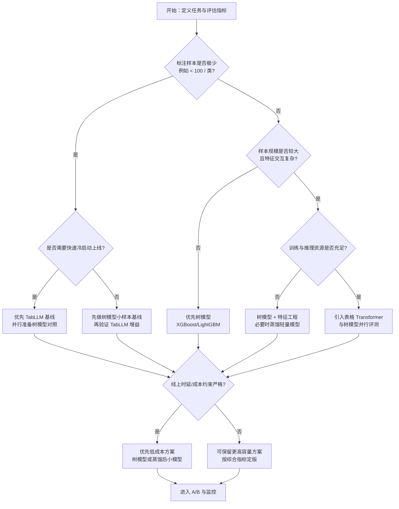

# 表格建模选型决策树

> 关联页面：[[表格建模路线对比-TabLLM-vs-树模型-vs-Transformer]] · [[表格数据深度学习]] · [[TabLLM]]

用于在立项初期根据样本规模、标注预算、线上约束快速选择首发路线。

## 决策树（简版）

## 快速决策表

| 约束条件 | 首选路线 | 备选路线 | 备注 |
|----------|----------|----------|------|
| 极少样本、需快速冷启动 | TabLLM | 树模型 | 关注提示模板稳定性与审计 |
| 中小样本、成本敏感 | 树模型 | TabLLM | 常作为默认稳健起点 |
| 大样本、交互复杂、资源充足 | 表格 Transformer | 树模型 | 需严格对照实验防“复杂即更优”偏差 |
| 强时延/强成本约束 | 树模型或蒸馏小模型 | TabLLM/Transformer | 先满足 SLA，再追求边际精度 |

## 实施建议

1. **永远双基线**：至少保留一个树模型基线作为参照。  
2. **分阶段收敛**：冷启动期可用 TabLLM，数据增长后重跑三路线对比。  
3. **统一评测面板**：离线指标 + 延迟 + 成本 + 可解释性 + 风险审计。  
4. **版本化模板与特征字典**：避免 TabLLM 序列化方式漂移导致回归。

## 边界说明

- 本决策树用于“首发路线选择”，不替代完整实验设计。  
- 关键阈值（如样本量、时延预算）应按业务域与数据分布调整。
